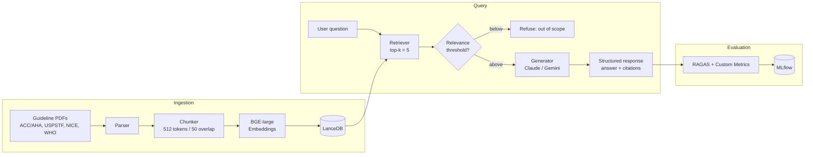

# ClinCite-HTN

> **Citation-verified clinical Q&A over hypertension guidelines, with measured faithfulness scores.**

[](https://opensource.org/licenses/MIT)
[](https://www.python.org/downloads/)
[](https://huggingface.co/spaces/YOUR_USERNAME/clinrag-htn)

**🔗 [Live Demo](https://huggingface.co/spaces/YOUR_USERNAME/clinrag-htn)** · **🎥 [3-min Walkthrough](https://loom.com/PLACEHOLDER)** · **📊 [Evaluation Report](./docs/evaluation.md)**

---

## ⚠️ Medical Disclaimer

This is a **portfolio / educational project**. The system answers questions using public clinical guidelines but **is not a medical device, does not provide medical advice, and must not be used for patient care or clinical decision-making.** Always consult a qualified healthcare professional.

---

## The Problem

LLMs hallucinate medical information confidently. Standard RAG reduces hallucination but doesn't eliminate it — and most projects never measure how much. For any healthcare-adjacent AI to be trustworthy, three things must be true and **provable**:

1. Every claim is grounded in a real source
2. The system knows when to refuse
3. Faithfulness is measured, not assumed

ClinCite-HTN demonstrates all three on a focused corpus: hypertension clinical guidelines.

---

## What Makes This Different

- 🔒 **Enforced inline citations** — no claim ships without a `[doc_id]` tag
- 🚫 **Out-of-scope refusal** — refuses non-hypertension questions instead of guessing
- 📏 **Measured, not assumed** — RAGAS + custom metrics on a 40-question golden test set
- ⚔️ **Head-to-head model comparison** — Claude Sonnet 4.6 vs Gemini 2.5 Pro on faithfulness, citation accuracy, and refusal behavior
- 🧪 **Adversarial test cases** — explicitly designed to elicit hallucination

---

## Architecture



---

## Evaluation Results

> Results from 40-question golden test set across both LLMs. See [docs/evaluation.md](./docs/evaluation.md) for methodology.

| Metric | Claude Sonnet 4.6 | Gemini 2.5 Pro | Target |
|---|---|---|---|
| Faithfulness (RAGAS) | _TBD_ | _TBD_ | > 0.85 |
| Answer Relevancy | _TBD_ | _TBD_ | > 0.80 |
| Context Precision | _TBD_ | _TBD_ | > 0.70 |
| Context Recall | _TBD_ | _TBD_ | > 0.75 |
| **Citation Accuracy** | _TBD_ | _TBD_ | > 0.90 |
| **Hallucination Rate** | _TBD_ | _TBD_ | < 5% |
| **Refusal Rate (OOS)** | _TBD_ | _TBD_ | > 95% |

_[Comparison chart goes here once eval is complete]_

---

## Tech Stack

| Layer | Tool |
|---|---|
| Document parsing | `pypdf`, `beautifulsoup4` |
| Embeddings | `BAAI/bge-large-en-v1.5` |
| Vector store | LanceDB |
| RAG framework | LlamaIndex |
| LLMs | Claude Sonnet 4.6, Gemini 2.5 Pro |
| Evaluation | RAGAS + custom metrics |
| Experiment tracking | MLflow |
| UI | Streamlit |
| Deployment | HuggingFace Spaces |
| CI | GitHub Actions |

---

## Quickstart

```bash
# Clone
git clone https://github.com/YOUR_USERNAME/clinrag-hypertension.git
cd clinrag-hypertension

# Environment
uv venv && source .venv/bin/activate
uv pip install -e ".[dev]"

# Configure
cp .env.example .env
# Add ANTHROPIC_API_KEY and GOOGLE_API_KEY

# Build the index (one-time)
python -m clinrag.ingest

# Run the app
streamlit run app/streamlit_app.py

# Run evaluation
python -m clinrag.evaluate --model claude
python -m clinrag.evaluate --model gemini
mlflow ui  # view results
```

---

## Project Structure

```
clinrag-hypertension/
├── app/
│   └── streamlit_app.py       # Demo UI
├── clinrag/
│   ├── ingest.py              # Corpus → vector store
│   ├── retrieve.py            # Retrieval logic + scoring
│   ├── generate.py            # RAG chain with citation enforcement
│   ├── evaluate.py            # RAGAS + custom metrics runner
│   └── prompts/               # System prompts (versioned)
├── data/
│   ├── corpus/                # Source guideline PDFs
│   ├── corpus_manifest.csv    # Document inventory + provenance
│   └── eval/
│       └── golden_set.jsonl   # 40-question test set
├── docs/
│   ├── corpus.md              # Corpus documentation
│   ├── evaluation.md          # Eval methodology + results writeup
│   └── architecture.md        # System design decisions
├── tests/
└── README.md
```

---

## How It Works

### 1. Corpus Curation
~75–100 documents from authoritative sources: ACC/AHA, USPSTF, JNC 8, NICE NG136, CDC, and WHO. Every document is tracked in `data/corpus_manifest.csv` with source URL, publication date, and license.

### 2. Citation Enforcement
The generator is constrained to return a Pydantic-validated structure: `{answer: str, citations: list[Citation]}`. Each citation references a `doc_id` from the manifest. Responses without valid citations fail validation and are regenerated.

### 3. Out-of-Scope Refusal
If the top-k retrieval scores fall below a calibrated threshold, the system refuses rather than answering. Threshold was tuned on the out-of-scope subset of the golden test set.

### 4. Evaluation
40-question golden test set: 25 in-scope factual, 10 out-of-scope, 5 adversarial. Scored on standard RAGAS metrics plus three custom metrics (citation accuracy, hallucination rate, refusal rate). Full methodology in [docs/evaluation.md](./docs/evaluation.md).

---

## Limitations

- **Domain**: hypertension only. Out-of-domain refusal is by design, not a bug.
- **Corpus age**: guidelines are dated; recommendations evolve. Each citation includes publication date.
- **Adversarial robustness**: tested against 5 adversarial cases but not exhaustively red-teamed.
- **Not a medical device**: see disclaimer above.

---

## Roadmap

- [ ] v1.0 — Initial release with two-model comparison
- [ ] v1.1 — Hybrid retrieval (BM25 + dense)
- [ ] v1.2 — Query decomposition for complex multi-hop questions
- [ ] v2.0 — Expand to a second domain (diabetes) with shared infrastructure

---

## References

Clinical sources used:
- ACC/AHA. *2017 Guideline for the Prevention, Detection, Evaluation, and Management of High Blood Pressure in Adults.*
- U.S. Preventive Services Task Force. *Hypertension in Adults: Screening.*
- NICE. *NG136 — Hypertension in adults: diagnosis and management.*
- World Health Organization. *Guideline for the pharmacological treatment of hypertension in adults.*
- CDC. *High Blood Pressure resources.*

Full manifest with URLs in [data/corpus_manifest.csv](./data/corpus_manifest.csv).

---

## License

MIT — see [LICENSE](./LICENSE).

This project is part of a 5-project Gen AI / Agentic AI portfolio. Other projects (in progress):

- 🚚 Supply Chain — Agentic demand forecasting & procurement copilot
- 💰 Financial — Multi-agent investment research system
- 💻 Tech — Code intelligence agent for data pipelines
- 🌍 Capstone — Generative agent-based simulation lab

---

_Built by [Carlos] · [LinkedIn] · [Portfolio Site]_
