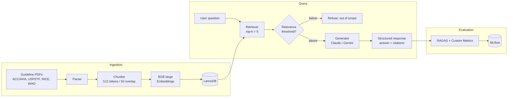

# ClinCite-HTN

> **Citation-verified clinical Q&A over hypertension guidelines, with measured faithfulness scores.**

[](https://opensource.org/licenses/MIT)
[](https://www.python.org/downloads/)
[](https://huggingface.co/spaces/cemg19/clinrag-htn)

**🔗 [Live Demo](https://huggingface.co/spaces/cemg19/clinrag-htn)** · **🎥 [3-min Walkthrough](https://loom.com/PLACEHOLDER)** · **📊 [Evaluation Report](./docs/evaluation.md)**

---

## ⚠️ Medical Disclaimer

This is a **portfolio / educational project**. The system answers questions using public clinical guidelines but **is not a medical device, does not provide medical advice, and must not be used for patient care or clinical decision-making.** Always consult a qualified healthcare professional.

---

## The Problem

LLMs hallucinate medical information confidently. Standard RAG reduces hallucination but doesn't eliminate it — and most projects never measure how much. For any healthcare-adjacent AI to be trustworthy, three things must be true and **provable**:

1. Every claim is grounded in a real source
2. The system knows when to refuse
3. Faithfulness is measured, not assumed

ClinCite-HTN demonstrates all three on a focused corpus: hypertension clinical guidelines.

---

## What Makes This Different

- 🔒 **Enforced inline citations** — no claim ships without a `[doc_id]` tag
- 🚫 **Out-of-scope refusal** — refuses non-hypertension questions instead of guessing
- 📏 **Measured, not assumed** — RAGAS + custom metrics on a 40-question golden test set
- ⚔️ **Head-to-head model comparison** — Claude Sonnet 4.6 vs Gemini 2.5 Pro on faithfulness, citation accuracy, and refusal behavior
- 🧪 **Adversarial test cases** — explicitly designed to elicit hallucination

---

## Architecture



Full component breakdown and design decisions: [docs/architecture.md](./docs/architecture.md).

---

## Evaluation Results

> Results from 40-question golden test set across both LLMs. See [docs/evaluation.md](./docs/evaluation.md) for methodology.

| Metric | Claude Sonnet 4.6 | Gemini 2.5 Pro | Target |
|---|---|---|---|
| Faithfulness (RAGAS) | 0.964 | 0.951 | > 0.85 |
| Answer Relevancy | 0.927 | 0.928 | > 0.80 |
| Context Precision | 0.696 | 0.703 | > 0.70 |
| Context Recall | 0.927 | 0.906 | > 0.75 |
| **Citation Accuracy** | 0.992 | 0.952 | > 0.90 |
| **Hallucination Rate** | 8.3% | 12.0% | < 5% |
| **Refusal Rate (OOS)** | 100% | 100% | > 95% |
| **Adversarial Pass Rate** | 100% | 100% | > 90% |

Seven of nine metrics clear target for both models; hallucination rate and
context precision do not. The honest numbers and the reasons are in
[docs/evaluation.md](./docs/evaluation.md).


---

## Tech Stack

| Layer | Tool |
|---|---|
| Document parsing | `pymupdf`, `beautifulsoup4` |
| Embeddings | `BAAI/bge-large-en-v1.5` |
| Vector store | LanceDB |
| RAG framework | LlamaIndex |
| LLMs (under test) | Claude Sonnet 4.6, Gemini 2.5 Pro |
| Evaluation | RAGAS + custom metrics (judge: Claude Haiku 4.5) |
| Experiment tracking | MLflow |
| UI | Streamlit |
| Deployment | HuggingFace Spaces |
| CI | GitHub Actions |

---

## Quickstart

```bash
# Clone
git clone https://github.com/carlosemg18/clinrag-hypertension.git
cd clinrag-hypertension

# Environment
uv venv && source .venv/bin/activate
uv pip install -e ".[dev]"

# Configure
cp .env.example .env
# Add ANTHROPIC_API_KEY and GOOGLE_API_KEY

# Build the index (one-time)
python -m clinrag.ingest

# Run the app
streamlit run app/streamlit_app.py

# Run evaluation
python -m clinrag.evaluate --model claude
python -m clinrag.evaluate --model gemini
mlflow ui  # view results
```

Deploying the app to a HuggingFace Space: see [docs/deploy.md](./docs/deploy.md).

---

## Project Structure

```
clinrag-hypertension/
├── app/
│   └── streamlit_app.py       # Demo UI (Ask + Evaluation views)
├── clinrag/
│   ├── config.py              # Paths + env-driven settings
│   ├── parsing.py             # PDF (PyMuPDF) / HTML (BeautifulSoup) → text
│   ├── embedding.py           # Shared BGE-large embedding model
│   ├── ingest.py              # Corpus → LanceDB
│   ├── retrieve.py            # Retrieval + out-of-scope relevance gate
│   ├── llm.py                 # Claude + Gemini backends
│   ├── schema.py              # Structured response contract
│   ├── generate.py            # RAG chain with citation enforcement
│   ├── metrics.py             # Custom eval metrics
│   ├── evaluate.py            # RAGAS + custom metrics runner
│   ├── tracking.py            # MLflow setup
│   └── prompts/
│       └── system_v1.md       # Citation-enforcing system prompt
├── data/
│   ├── corpus/                # Source guideline PDFs/HTML (git-ignored)
│   ├── corpus_manifest.csv    # Document inventory + provenance
│   └── eval/
│       ├── golden_set.jsonl   # 40-question test set
│       └── results_*.csv      # Per-question evaluation results
├── scripts/
│   ├── download_corpus.py     # Fetch the corpus from the manifest
│   ├── retrieval_sanity_check.py
│   └── generation_smoke_test.py
├── docs/
│   ├── corpus.md              # Corpus provenance + licensing
│   ├── evaluation.md          # Eval methodology + results writeup
│   ├── architecture.md        # System design + diagram
│   └── deploy.md              # HuggingFace Spaces deploy guide
├── requirements.txt           # Inference deps (for the Space)
├── pyproject.toml             # Full project + dev deps
└── README.md
```

---

## How It Works

### 1. Corpus Curation
Nine source documents from six authoritative bodies — ACC/AHA, JNC 8, NICE NG136, USPSTF, WHO, and CDC — parsed and split into ~1,600 retrievable chunks. Every document is tracked in `data/corpus_manifest.csv` with source URL, publication date, and license. See [docs/corpus.md](./docs/corpus.md).

### 2. Citation Enforcement
The generator must return a Pydantic-validated structure: `{answerable: bool, answer: str, citations: list[Citation]}`. A citation is valid only if its `doc_id` is one of the retrieved chunks. If the first attempt cites an unknown `doc_id`, cites nothing, or omits the inline `[doc_id]` marker, one corrective retry is issued before the response is returned.

### 3. Out-of-Scope Refusal
Two refusal paths: (1) if the top retrieved chunk scores below the relevance threshold (0.50, set from the observed in-scope vs. out-of-scope score separation), the question is out of scope and no LLM call is made; (2) if relevant-looking chunks come back but do not actually contain the answer, the model returns `answerable=false` and the response is treated as a refusal rather than a guess.

### 4. Evaluation
40-question golden test set (25 in-scope, 10 out-of-scope, 5 adversarial), scored with RAGAS (faithfulness, answer relevancy, context precision/recall) plus custom metrics (citation accuracy, hallucination rate, refusal rate, adversarial pass rate). The judge is Claude Haiku 4.5 — a third model, not under test. Full methodology, before/after iteration, and failure modes in [docs/evaluation.md](./docs/evaluation.md).

---

## Limitations

- **Hallucination rate misses its target** (8.3% Claude / 12.0% Gemini vs. < 5%). The metric is strict — one untraceable citation quote flags the whole response. Reported honestly rather than tuned away; details in [docs/evaluation.md](./docs/evaluation.md).
- **Recall/precision trade-off**: raising `top_k` to 8 cut false refusals but nudged context precision to the target line (Claude 0.696). A reranker would likely recover it.
- **Small test set**: 40 questions means wide confidence intervals — treat small differences between models as noise.
- **Single judge**: one judge model (Haiku 4.5); a panel would be more robust. Ground-truth answers were author-written from the guidelines.
- **Corpus quality varies**: the JNC 8 PDF is the weakest source even after switching to PyMuPDF (broken space encoding on some pages).
- **Corpus age**: guidelines are dated; recommendations evolve. Each citation carries its publication date.
- **Domain**: hypertension only — out-of-domain refusal is by design, not a bug.
- **Not a medical device**: see disclaimer above.

---

## Roadmap

- [ ] v1.0 — Initial release with two-model comparison
- [ ] v1.1 — Hybrid retrieval (BM25 + dense)
- [ ] v1.2 — Query decomposition for complex multi-hop questions
- [ ] v2.0 — Expand to a second domain (diabetes) with shared infrastructure

---

## References

Clinical sources used:
- ACC/AHA. *2017 Guideline for the Prevention, Detection, Evaluation, and Management of High Blood Pressure in Adults.*
- U.S. Preventive Services Task Force. *Hypertension in Adults: Screening.*
- NICE. *NG136 — Hypertension in adults: diagnosis and management.*
- World Health Organization. *Guideline for the pharmacological treatment of hypertension in adults.*
- CDC. *High Blood Pressure resources.*

Full manifest with URLs in [data/corpus_manifest.csv](./data/corpus_manifest.csv).

---

## License

MIT — see [LICENSE](./LICENSE).

This project is part of a 5-project Gen AI / Agentic AI portfolio. Other projects (in progress):

- 🚚 Supply Chain — Agentic demand forecasting & procurement copilot
- 💰 Financial — Multi-agent investment research system
- 💻 Tech — Code intelligence agent for data pipelines
- 🌍 Capstone — Generative agent-based simulation lab

---

_Built by [Carlos] · [LinkedIn] · [Portfolio Site]_
