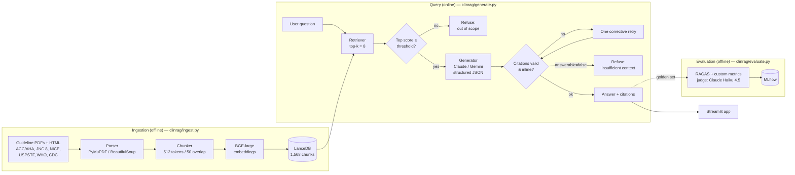

# Architecture

ClinCite-HTN is a retrieval-augmented Q&A system with three stages: ingestion
(offline), query (online), and evaluation (offline). The design goal is not raw
answer quality but **provable grounding** — every claim cites a real source, the
system refuses when it should, and the whole thing is measured.

## Components

| Module | Responsibility |
|---|---|
| `clinrag/config.py` | Paths and env-driven settings (models, top-k, threshold) |
| `clinrag/parsing.py` | PDF → per-page text (PyMuPDF), HTML → per-section text (BeautifulSoup) |
| `clinrag/embedding.py` | The shared BGE-large embedding model |
| `clinrag/ingest.py` | Parse → chunk → embed → load LanceDB |
| `clinrag/retrieve.py` | Top-k retrieval + the out-of-scope relevance gate |
| `clinrag/llm.py` | Claude (forced tool use) and Gemini (JSON schema) backends |
| `clinrag/schema.py` | `LLMAnswer` (model contract) and `RAGResponse` (pipeline result) |
| `clinrag/generate.py` | The RAG chain: retrieve → gate → generate → validate citations |
| `clinrag/metrics.py` | Custom metrics (citation integrity, hallucination, adversarial judge) |
| `clinrag/evaluate.py` | RAGAS + custom scoring over the golden set, logged to MLflow |
| `app/streamlit_app.py` | Demo UI: Q&A with hover citations + evaluation dashboard |

## Two refusal paths

1. **Retrieval gate** — if the top retrieved chunk scores below
   `RELEVANCE_THRESHOLD` (0.50), the question is treated as out of scope and no
   LLM call is made. Cheap and deterministic.
2. **LLM gate** — if relevant-looking chunks come back but do not actually
   contain the answer, the model returns `answerable=false` and the response is
   treated as a refusal rather than a guess.

## Citation enforcement

The generator must return a structured `LLMAnswer` (`answerable`, `answer`,
`citations[]`). A citation is valid only if its `doc_id` is one of the retrieved
chunks. If the first attempt cites an unknown `doc_id`, cites nothing, or omits
the inline `[doc_id]` marker, one corrective retry is issued before the response
is returned. This is what makes "no claim ships without a `[doc_id]`" enforceable
rather than aspirational.

## Key design decisions

| Decision | Rationale |
|---|---|
| LanceDB | Embedded, file-based vector store — no server process, 13 MB on disk |
| BGE-large (local) | Strong on medical text, free, no embedding API calls |
| Shared `LLMAnswer` schema | Claude and Gemini graded on an identical contract |
| Separate judge (Haiku 4.5) | A third model grades both — no self-judging bias |
| PyMuPDF over pypdf | Correct glyph decoding (pypdf mangled the JNC 8 PDF) |
| top-k = 8 | Raised from 5 to cut false refusals (trades a little precision) |
