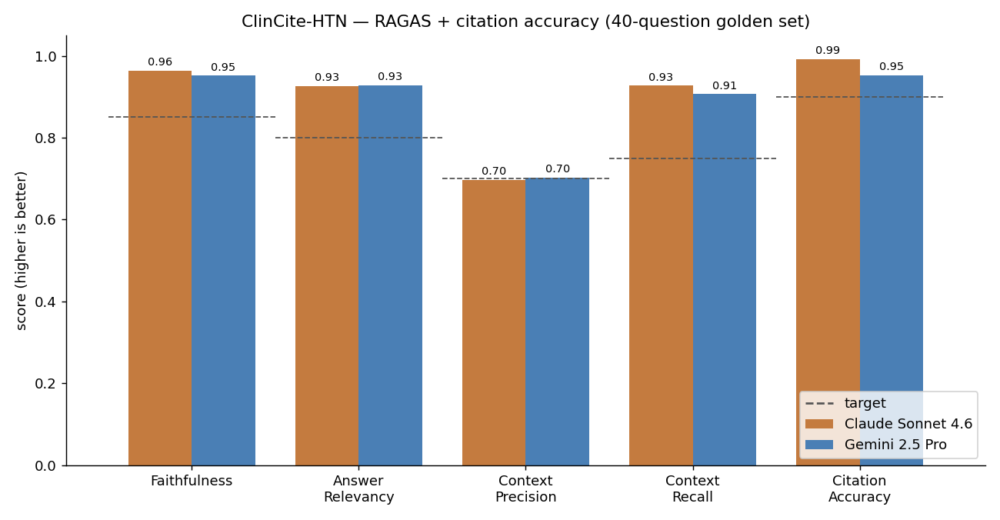

# Evaluation — Methodology and Results

ClinCite-HTN is evaluated on a fixed 40-question golden test set, scored with
RAGAS (LLM-graded) plus five custom metrics. The point of this project is to
**measure** hallucination rather than assume it away — so the methodology and
the failure modes are documented here in full, including where the system
misses its targets.

## Golden test set

[`data/eval/golden_set.jsonl`](../data/eval/golden_set.jsonl) — 40 questions:

| Subset | Count | Purpose |
|---|---|---|
| In-scope factual | 25 | Answerable hypertension questions; each has reference doc_ids and a ground-truth answer |
| Out-of-scope | 10 | Non-hypertension questions (diabetes, asthma, oncology, a geography question, a coding question) — the system should refuse |
| Adversarial | 5 | Hypertension questions built on a **false premise** — the system must reject the premise, not hallucinate around it |

The in-scope questions span all six corpus sources (ACC/AHA, JNC 8, NICE,
USPSTF, WHO, CDC) and cover definitions, diagnosis, screening, treatment
thresholds, drug selection, targets, lifestyle, and special populations.

## Metrics

### RAGAS (LLM-graded), in-scope answered responses only

| Metric | What it measures |
|---|---|
| Faithfulness | Are the answer's claims supported by the retrieved context? |
| Answer Relevancy | Does the answer actually address the question? |
| Context Precision | Are the retrieved chunks relevant (vs. noise)? |
| Context Recall | Did retrieval bring back what the ground-truth answer needs? |

### Custom (deterministic + a small judge)

| Metric | Definition |
|---|---|
| Citation Accuracy | Fraction of citations whose `doc_id` is in the retrieved context **and** whose quote is traceable to that context |
| Hallucination Rate | Fraction of answered responses with any unsound citation (invalid doc_id, untraceable quote, no citation) or an endorsed false premise |
| Refusal Rate (OOS) | Fraction of out-of-scope questions correctly refused |
| Adversarial Pass Rate | Fraction of adversarial questions where the false premise was rejected (refused or corrected, judged by LLM) |
| False Refusal Rate | Fraction of in-scope questions wrongly refused (lower is better) |

Faithfulness and Hallucination Rate are deliberately **independent** views of
grounding: faithfulness is LLM-graded claim support; hallucination rate is a
deterministic check on citation integrity. A system can score well on one and
poorly on the other.

### Judge model

RAGAS scoring and the adversarial-premise check use **Claude Haiku 4.5** — a
third model that is *not under test*, so it never grades its own output. This
removes the self-judging bias that would arise from using Sonnet (a contestant)
as the judge, and Haiku's higher rate limits make the ~360-call eval tractable.

## Results

40-question golden set. RAGAS metrics are over the in-scope answered subset
(24/25 — see false refusals below). Numbers are the post-iteration run.

| Metric | Claude Sonnet 4.6 | Gemini 2.5 Pro | Target |
|---|---|---|---|
| Faithfulness | 0.964 | 0.951 | > 0.85 |
| Answer Relevancy | 0.927 | 0.928 | > 0.80 |
| Context Precision | 0.696 | 0.703 | > 0.70 |
| Context Recall | 0.927 | 0.906 | > 0.75 |
| **Citation Accuracy** | 0.992 | 0.952 | > 0.90 |
| **Hallucination Rate** | 0.083 | 0.120 | < 0.05 |
| **Refusal Rate (OOS)** | 1.000 | 1.000 | > 0.95 |
| **Adversarial Pass Rate** | 1.000 | 1.000 | > 0.90 |
| False Refusal Rate | 0.040 | 0.040 | ~ 0.00 |

Seven of nine metrics clear their targets for both models. Two do not — see
*Where it falls short* below.



*Bars are the two models under test; dashed lines are the targets. Regenerate
with `python scripts/plot_eval.py`.*

**Claude vs. Gemini.** The two models are close. Claude leads on faithfulness
(0.964 vs 0.951), citation accuracy (0.992 vs 0.952), and hallucination rate
(0.083 vs 0.120) — i.e. on citation discipline, the project's core thesis.
Gemini is level on answer relevancy and context precision. Both refuse 100% of
out-of-scope questions and reject 100% of adversarial false premises.

## The iteration

The first evaluation run exposed two weak areas; one change round addressed
each, and the table above is the post-change result.

| Metric (Claude / Gemini) | Before | After |
|---|---|---|
| Faithfulness | 0.923 / 0.901 | 0.964 / 0.951 |
| Citation Accuracy | 0.966 / 0.914 | 0.992 / 0.952 |
| Context Recall | 0.853 / 0.892 | 0.927 / 0.906 |
| Hallucination Rate | 0.087 / 0.174 | 0.083 / 0.120 |
| False Refusal Rate | 0.080 / 0.120 | 0.040 / 0.040 |
| Context Precision | 0.742 / 0.753 | 0.696 / 0.703 |

**Change 1 — PDF parser.** The JNC 8 source PDF was extracted by `pypdf` as raw
glyph codes (`/H11350...`). Faithful citation quotes could not be traced back to
that mangled text, so JNC 8 questions were flagged as hallucinations. Switching
to PyMuPDF resolved the glyph encoding. The quote-grounding check was also made
whitespace-insensitive, because the JNC 8 PDF still has broken space encoding on
some pages and a verbatim quote should not be penalised for spacing alone.

**Change 2 — retrieval depth.** Several in-scope questions were wrongly refused:
retrieval did not surface the defining chunk within the top-5, so the model
correctly declined rather than guess. Raising `top_k` from 5 to 8 halved the
false refusal rate (0.08/0.12 → 0.04/0.04) and lifted context recall.

**The trade-off.** Raising `top_k` also added less-relevant chunks, nudging
context precision down (Claude 0.742 → 0.696, just under target; Gemini
0.753 → 0.703). This is the expected recall/precision tension and is reported
rather than hidden.

## Where it falls short

- **Hallucination rate misses the < 0.05 target** (0.083 / 0.120). The metric
  is per-response and strict: one citation with a quote that cannot be traced
  verbatim flags the whole response. After the JNC 8 fix the residual cases are
  isolated single-quote mismatches (a lightly paraphrased quote, a quote
  spanning a chunk boundary) and, in one Claude response, an answer returned
  with an empty citations array despite the corrective retry. Honest result: a
  hard target, not fully met.
- **Context precision is at/below target** (Claude 0.696). A direct consequence
  of `top_k = 8`; a hybrid or reranked retriever would likely recover it.
- **One stubborn false refusal** (`in-03`, the definition of "elevated blood
  pressure"): the ACC/AHA classification chunk is not retrieved even at
  `top_k = 8`, against ~1,250 competing ACC/AHA chunks.

## Reproducing

```bash
python -m clinrag.ingest                       # build the index
python -m clinrag.evaluate --model claude      # run each model in its own
python -m clinrag.evaluate --model gemini      #   process (see note below)
mlflow ui                                      # browse logged runs
```

Per-question results are written to `data/eval/results_<model>.csv` and logged
to MLflow with all parameters (chunk size, top_k, threshold, prompt version,
judge model). The two models are evaluated in **separate processes** — RAGAS's
evaluation executor does not reliably support two `evaluate()` calls in one
process, which caused the second run to hang during development.

## Limitations of this evaluation

- **40 questions is small.** Metrics have wide confidence intervals; treat
  differences below a few points as noise.
- **Single judge.** Haiku 4.5 is one judge; a panel would be more robust.
- **Author-written ground truth.** Reference answers were written from the
  guidelines by the project author, not from an independent clinical source.
- **Corpus quality varies.** The JNC 8 PDF remains the lowest-quality source
  even after the parser fix (see [corpus.md](corpus.md)).
